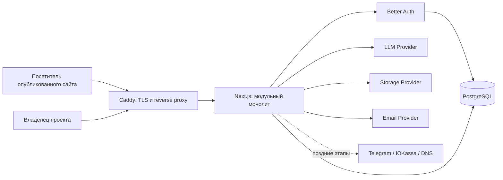

# Архитектура Lando

Статус: целевая архитектура MVP, Этап 0  
Последнее обновление: 26 июля 2026 года

## 1. Назначение документа

Lando — русскоязычный B2C SaaS для создания одностраничного сайта по текстовому описанию. Этот документ задаёт технические границы продукта до начала реализации.

Главная архитектурная гарантия: Lando не генерирует и не исполняет пользовательский или AI-сгенерированный код. AI возвращает только данные, прошедшие строгую проверку, а сайт собирается из заранее написанных React-компонентов.

Цели MVP:

- полный путь «запрос → генерация → редактор → публикация»;
- изоляция данных владельцев;
- независимые черновик и опубликованный снимок;
- возможность заменить AI, хранилище, оплату и доменную инфраструктуру без переписывания бизнес-логики;
- один развёртываемый модульный монолит без преждевременных микросервисов.

Не входят в MVP: интернет-магазин, многостраничность, блог, Zero Block, произвольные HTML/CSS/JavaScript, импорт Figma, совместное редактирование, marketplace, A/B-тесты, мобильное приложение, white label и экспорт React-кода.

## 2. Контекст и компоненты



Модульный монолит — один Next.js-процесс и одна PostgreSQL-база. Модули разделены в коде и общаются через типизированные прикладные сервисы. UI и HTTP-слой не обращаются к Prisma, секретам или внешним SDK напрямую.

## 3. Утверждённый стек

- Next.js с App Router и React;
- TypeScript с `strict: true`;
- Tailwind CSS и shadcn/ui;
- PostgreSQL и Prisma ORM;
- Zod как единая runtime-валидация на внешних и JSONB-границах;
- Better Auth с официальным Prisma-адаптером;
- dnd-kit для редактора;
- Vitest, Testing Library и Playwright;
- Docker, Docker Compose и Caddy;
- ESLint и Prettier.

Привязка к Vercel, Supabase, Firebase, Clerk или одному облаку запрещена. Версии зависимостей фиксируются lock-файлом; миграции и конфигурация проверяются при каждом обновлении пакетов.

## 4. Слои и направления зависимостей

```text
app / components
        ↓
features/* (use cases, DTO, policy)
        ↓
server / lib (DAL, providers, security)
        ↓
Prisma / PostgreSQL и внешние API
```

Правила:

1. Компонент клиента получает только минимальный DTO и не импортирует серверные модули.
2. Route Handler или Server Action считается публичной точкой входа: повторно проверяет сессию, владение, лимиты и входные данные.
3. Прикладной сервис не зависит от конкретного LLM, storage, billing или domain SDK — только от интерфейса провайдера.
4. Prisma доступен только серверному DAL/репозиториям.
5. Общие схемы и безопасные публичные типы не импортируют серверные секреты.
6. Ошибки наружу преобразуются в стабильные коды и понятные русские сообщения; детали и секреты не выдаются клиенту.

Предлагаемая структура:

```text
src/
  app/                       # маршруты, layouts, Route Handlers
  components/
    editor/
    blocks/                  # закрытый реестр разрешённых блоков
    dashboard/
    marketing/
    public-site/
    ui/
  features/
    ai/
    auth/
    billing/
    domains/
    forms/
    integrations/
    projects/
    publishing/
    submissions/
  lib/
    ai/
    db/
    security/
    storage/
    validation/
  server/                    # DAL, прикладные сервисы, server-only wiring
  types/
prisma/
tests/
docs/
```

Запланированные поверхности:

- публичная платформа: `/`, `/examples`, `/pricing`, `/faq`, юридические страницы;
- авторизация: `/login`, `/register`, подтверждение email и восстановление пароля;
- кабинет: `/dashboard`, `/dashboard/projects/[projectId]/editor`, настройки, публикация и последующие модули;
- Better Auth: `/api/auth/[...all]`;
- локальная публикация: `/s/[slug]`;
- production: `https://{slug}.{PLATFORM_ROOT_DOMAIN}`, а позднее подтверждённые пользовательские домены.

## 5. Модульные границы

| Модуль               | Ответственность                                                         | Не делает                                                                |
| -------------------- | ----------------------------------------------------------------------- | ------------------------------------------------------------------------ |
| `auth`               | конфигурация Better Auth, сессия, регистрация, email verification/reset | не решает владение проектом по одному факту входа                        |
| `projects`           | проект, slug, статус, квоты, создание первого Page                      | не рендерит страницу                                                     |
| `ai`                 | provider interface, prompt/input DTO, JSON parsing, repair, usage       | не исполняет ответ и не читает всю БД                                    |
| `editor`             | команды над draft, optimistic revision, история                         | не меняет published                                                      |
| `publishing`         | атомарный снимок draft → published, unpublish, cache invalidation       | не принимает схему с клиента как опубликованную истину                   |
| `blocks/public-site` | закрытый registry React-компонентов и безопасный renderer               | не использует dynamic import по данным, HTML injection или editor bundle |
| `forms/submissions`  | схема формы, антиспам, заявки                                           | не доверяет payload и не хранит полный IP без необходимости              |
| `storage`            | безопасная загрузка и URL через provider                                | не принимает произвольный SVG в MVP                                      |
| `integrations`       | Telegram и Метрика по разрешённым настройкам                            | не принимает произвольный JavaScript                                     |
| `billing`            | тарифы, серверные лимиты, provider, webhook                             | не доверяет тарифу от клиента                                            |
| `domains`            | нормализация, DNS verification, attach/detach                           | не запрашивает пароль регистратора                                       |
| `audit`              | события безопасности и важных действий                                  | не пишет секреты и полный пользовательский payload                       |

## 6. Авторизация и владение

Better Auth отвечает за email/password, подтверждение email, вход, выход, reset/change password и серверные сессии. Используется схема таблиц, сгенерированная для фактически зафиксированной версии Better Auth; параллельный собственный password hash не создаётся.

Сессии — серверные и хранятся в PostgreSQL. Cookie в production: `HttpOnly`, `Secure`, `SameSite=Lax`, минимально необходимый `Path`; cross-subdomain cookie для публичных сайтов не включается. Публичным лендингам авторизационная cookie не нужна. Чувствительные действия требуют свежей серверной проверки сессии.

Единый серверный путь доступа:

1. `requireUser(request)` валидирует сессию.
2. Входной DTO проходит Zod.
3. `getOwnedProject(userId, projectId)` делает запрос с ограничением одновременно по `id` и `userId`.
4. Вложенные Page, Asset, Form, Integration и Domain загружаются только через связь с уже авторизованным Project.
5. Запись повторяет тот же owner predicate или выполняется в транзакции после блокирующей/оптимистической проверки revision.
6. Отсутствие ресурса и чужой ресурс снаружи дают одинаковый `404`; это уменьшает перебор идентификаторов.

Скрытие кнопки в UI и route-level redirect — только удобство, не контроль доступа. Каждый Server Action и Route Handler самостоятельно вызывает DAL-проверки.

## 7. Модель хранения

Идентификаторы — непрозрачные CUID/UUID, время — UTC, email и hostname хранятся в нормализованном виде. Slug нормализуется в lowercase ASCII и глобально уникален, потому что одновременно служит путём `/s/{slug}` и будущим поддоменом.

| Сущность                                        | Основные связи и ограничения                                                                                                                              |
| ----------------------------------------------- | --------------------------------------------------------------------------------------------------------------------------------------------------------- |
| Better Auth `User/Session/Account/Verification` | официальная схема адаптера; уникальный нормализованный email; сессии индексированы по user и expiry                                                       |
| `Project`                                       | обязательный `userId`; уникальный `slug`; индекс `(userId, updatedAt)`; статус draft/published/archived                                                   |
| `Page`                                          | один к одному с Project; `draftSchema Json`; nullable `publishedSchema Json`; `publishedAt`; целочисленный `draftRevision` для защиты от потери изменений |
| `PageVersion`                                   | `pageId`, полный schema snapshot, source manual/ai/publish, nullable prompt, timestamp; индекс `(pageId, createdAt)`                                      |
| `Asset`                                         | принадлежит Project; storageKey уникален; MIME, size, dimensions, alt                                                                                     |
| `Domain`                                        | принадлежит Project; уникальный нормализованный hostname; token, domain status и ssl status                                                               |
| `Form`                                          | принадлежит Project и blockId; строгие fields JSON; уникальность `(projectId, blockId)`                                                                   |
| `Submission`                                    | принадлежит Form; validated payload, sourceUrl, keyed `ipHash`, status; индекс `(formId, createdAt)`                                                      |
| `Integration`                                   | принадлежит Project; уникальность `(projectId, type)`; versioned encryptedConfig                                                                          |
| `Subscription`                                  | принадлежит User; provider ids уникальны, plan/status/period                                                                                              |
| `AiUsage`                                       | user, project, operation, provider, token/cost telemetry                                                                                                  |
| `AuditLog`                                      | actor user, optional project, action, очищенная metadata                                                                                                  |

JSONB удобен для атомарных снимков страницы, но не является доверенной типизацией: любая запись и любое чтение `draftSchema`, `publishedSchema`, `PageVersion.schema` и других JSON-полей проходит соответствующую Zod-схему.

Каскады применяются только к данным, которыми полностью владеет агрегат и которые удаляются намеренно: Project → Page/PageVersion/Asset/Form/Domain/Integration и Form → Submission. Удаление пользователя или проекта выполняется отдельным подтверждённым use case и транзакцией; платежные и audit-записи не исчезают неявно. Конкретные retention-сроки утверждаются после юридической проверки.

## 8. Каноническая PageSchema v1

В JSON хранится поле `schemaVersion: 1`. Никакой runtime-объект не считается PageSchema только из-за TypeScript-типа.

```ts
type PageSchemaV1 = {
  schemaVersion: 1;
  site: {
    title: string;
    description: string;
    language: "ru";
    theme: PublishedSiteTheme;
    seo: SeoSchema;
  };
  blocks: BlockSchema[];
};

type PublishedSiteTheme = {
  colorMode: "light" | "dark" | "custom";
  primaryColor: string;
  backgroundColor: string;
  surfaceColor: string;
  textColor: string;
  mutedTextColor: string;
  headingFont: string;
  bodyFont: string;
  borderRadius: "small" | "medium" | "large";
};
```

`BlockSchema` — Zod `discriminatedUnion("type", ...)`. Общие поля: стабильный `id`, конкретные литералы `type` и `variant`, `hidden`, а также ограниченный объект оформления: background, textColor, padding и alignment. Тип блока нельзя поменять частичным обновлением; для этого блок заменяется валидной операцией.

| type           | Разрешённые варианты v1                            | Обязательный контракт content                                                       |
| -------------- | -------------------------------------------------- | ----------------------------------------------------------------------------------- |
| `header`       | simple, centered, with-cta                         | logoText, navLinks[], optional cta                                                  |
| `hero`         | centered, image-right, image-left, full-background | title, description, optional eyebrow/image, primaryButton, optional secondaryButton |
| `features`     | cards, icons-grid, numbered-list                   | title, items[{title, description, optional icon}]                                   |
| `services`     | cards, compact-list, image-grid                    | title, items[{title, description, optional price/image/button}]                     |
| `about`        | text, image-right, stats                           | title, text, optional image/stats[]                                                 |
| `steps`        | numbered, timeline, cards                          | title, items[{title, description}]                                                  |
| `gallery`      | grid, masonry, carousel                            | title, images[]                                                                     |
| `testimonials` | cards, quotes, featured                            | title, items[{quote, author, optional role/avatar}]                                 |
| `pricing`      | single-offer, cards, simple-list                   | title, plans[{name, priceText, features[], button}]                                 |
| `team`         | cards, compact, featured                           | title, members[{name, role, optional bio/image}]                                    |
| `faq`          | accordion, two-columns, simple                     | title, items[{question, answer}]                                                    |
| `cta`          | centered, split, banner                            | title, description, button, optional image                                          |
| `contacts`     | details, split, mapless                            | title, contacts[], optional address/hours                                           |
| `leadForm`     | card, split, minimal                               | title, description, formKey, fields[], submitLabel, successMessage, consent         |
| `footer`       | simple, columns, with-brand                        | brand, links[], optional legalText                                                  |

Вспомогательные схемы тоже строгие:

- `LinkAction` — discriminated union: внутренний scroll на существующий block id, безопасный `https/http` URL, `mailto` или `tel`; `javascript:`, `data:`, непроверенные redirects и произвольные протоколы запрещены;
- `ButtonSchema` — label, action и style из закрытого enum;
- `ImageRef` — ровно один из принадлежащего проекту `assetId` или ключа встроенного demo asset, обязательный alt и ограниченные crop/focal-point; data URL и произвольный remote URL запрещены;
- `SeoSchema` — title, description, optional owned favicon/OG image, canonical и `indexing: boolean`;
- `FormFieldSchema` — тип из name/phone/email/shortText/textarea/select/checkbox/consent, стабильный key, label, required и допустимые options;
- цвета — валидный ограниченный CSS color token/hex, шрифты — allowlist, размеры/отступы — enum, а не произвольный CSS.

Ограничения защиты ресурсов задаются централизованной конфигурацией и покрываются тестами: максимум блоков, элементов в массиве, длины строк и суммарный размер JSON. Начальные значения можно корректировать без миграции схемы; например, не более 40 блоков и не более 256 КБ canonical JSON.

Дополнительные инварианты после Zod:

- block id уникальны;
- scroll target существует;
- formKey и field key уникальны в своей области;
- не более одного видимого header/footer;
- страница содержит видимый содержательный блок;
- заголовки и обязательные поля не пусты после trim;
- ссылки, assetId и form references принадлежат тому же Project;
- renderer обеспечивает один H1 и корректную иерархию, не доверяя выбору HTML-тега из JSON.

### Pipeline недоверенного JSON

1. Ограничить размер ответа до JSON parse.
2. Распарсить JSON без выполнения.
3. Рекурсивно спроецировать только разрешённые ключи и очистить строки как plain text.
4. Проверить строгими Zod-схемами (canonical objects запрещают неизвестные поля).
5. Проверить межполевые и ownership-инварианты.
6. Для AI при ошибке разрешить ровно один repair-запрос с безопасным кратким описанием ошибок.
7. Повторно выполнить весь pipeline; при второй ошибке ничего не сохранять и вернуть понятный код ошибки.

Миграции `schemaVersion` — чистые функции `vN → vN+1`, применяемые на копии и завершающиеся полной валидацией. Исходный PageVersion не перезаписывается.

## 9. Безопасный renderer

Renderer выбирает компонент только из статического registry `type + variant`. Он передаёт компоненту проверенные props и никогда не использует `eval`, `new Function`, `dangerouslySetInnerHTML`, dynamic import по строке из схемы, iframe или AI-код.

Текст рендерится как текст React. Разметка внутри пользовательского текста не поддерживается. Ссылки проходят централизованный builder; внешние ссылки в новой вкладке получают безопасный `rel`. Метрика на позднем этапе формируется платформой из проверенного numeric counter id и не загружается в редакторе.

Публичный маршрут:

- не импортирует editor, dnd-kit, AI client или dashboard;
- выбирает проект только по нормализованному slug/подтверждённому hostname;
- требует `publishedAt != null` и читает только `publishedSchema`;
- повторно валидирует snapshot и при повреждении возвращает безопасную ошибку, а не draft;
- создаёт SEO/OG/canonical из проверенных полей.

## 10. Черновик, версии и публикация

`draftSchema` и `publishedSchema` — два самостоятельных JSON-снимка. Ссылочное присваивание или fallback публичного маршрута на draft запрещены.

Редактирование:

1. Авторизовать владельца.
2. Проверить ожидаемый `draftRevision`.
3. Валидировать команду/patch.
4. Применить к копии текущего draft.
5. Полностью провалидировать результат.
6. Сохранить новый draft и увеличить revision транзакционно.
7. Для значимых ручных/AI-изменений создать PageVersion; история удерживает минимум 20 последних версий.

Публикация выполняется одной транзакцией:

1. Проверить сессию, владение и серверные тарифные ограничения.
2. Прочитать и валидировать актуальный draft.
3. Создать PageVersion с source `publish`.
4. Глубоко скопировать canonical draft в published.
5. Установить `publishedAt` и статус Project.
6. Commit.
7. Только после commit инвалидировать cache/tag и показать ссылку.

Снятие с публикации обнуляет `publishedAt` и переводит статус, но сохраняет последний `publishedSchema` как обратимый снимок. Публичный resolver всё равно требует непустой `publishedAt`. Повторная публикация всегда создаёт новый снимок из текущего draft.

## 11. LLM Provider

```ts
interface LLMProvider {
  generatePage(input: GeneratePageInput): Promise<PageSchemaV1>;
  editPage(input: EditPageInput): Promise<PagePatch>;
  editBlock(input: EditBlockInput): Promise<BlockPatch>;
  regenerateText(input: RegenerateTextInput): Promise<TextResult>;
}
```

Выбор происходит только на сервере по `LLM_PROVIDER`. В production основная реализация — GigaChat; OpenAI и YandexGPT подключаются тем же интерфейсом. Credential никогда не передаётся клиенту. Провайдер получает минимальный prompt и текущий необходимый фрагмент страницы, а не запись пользователя, интеграции или доступ к БД.

Внешний provider wrapper задаёт timeout, отмену, ограниченный retry только для безопасных временных ошибок, размер ответа, correlation id и нормализованные ошибки. Логи не содержат полный prompt, ответы, email или секреты. Usage пишется после завершения без блокирования сохранения результата.

PagePatch — закрытый discriminated union: updateBlock, addBlock, removeBlock, moveBlock, updateSiteTheme, updateSeo. Patch не может менять owner/project/page id, `schemaVersion`, block `id/type` через changes или вставлять неизвестную операцию. После применения patch обязательно валидируется вся страница. Перед крупной AI-правкой создаётся версия.

## 12. Провайдеры других инфраструктур

- `StorageProvider`: local для разработки, S3-compatible для production. Загрузка JPEG/PNG/WebP проверяет размер, extension, MIME, magic bytes и dimensions; SVG запрещён.
- `ImageProvider`: в MVP только локальная лицензированная demo-библиотека; никаких случайных URL или обязательной AI-генерации.
- `EmailProvider`: console только для локальной разработки, SMTP для production; reset/verification token одноразовый и краткоживущий.
- `BillingProvider`: MockBilling и YooKassa; webhook проверяется до разбора бизнес-события и обрабатывается идемпотентно.
- `DomainInfrastructureProvider`: DNS verify, attach/detach. Домен активируется лишь после TXT ownership и корректной A/CNAME проверки.
- `DomainRegistrarProvider`: Regru-заготовка за выключенным feature flag; credential пользователя REG.RU не запрашиваются.

## 13. Безопасность по границам доверия

Обязательные меры:

- Zod для route params, body, Server Actions, env и JSONB;
- CSRF-защита механизма Better Auth плюс проверка Origin/Host для state-changing HTTP endpoints;
- rate limit для auth, генерации, reset/resend, uploads, DNS checks, billing и публичных форм;
- безопасные redirect только на локальные allowlisted пути;
- CSP отдельно для платформы и публичных сайтов; без `unsafe-eval`, а разрешения Метрики добавляются точечно;
- security headers, HTTPS, HSTS после проверки production-домена, `nosniff`, ограниченная referrer policy;
- секреты только в environment/secret storage, server-only модули и автоматическая проверка на попадание в client bundle/log;
- токены интеграций шифруются аутентифицированным алгоритмом с version/key id; UI после сохранения показывает только маску;
- формы: лимит body, honeypot, rate limit и keyed HMAC IP hash с ротацией, без полного IP;
- webhook: signature, timestamp/replay window, unique provider event id, transaction;
- AuditLog для входа, смены credential, публикации, удаления, доменов, интеграций и оплаты; metadata проходит allowlist;
- загрузки сохраняются под server-generated key и не исполняются; original filename не является путём;
- ошибки пользователю не раскрывают существование email, чужого ресурса, stack trace, SQL или ответ провайдера.

Юридическая безопасность не объявляется автоматически. До production нужны проверенные юристом политика конфиденциальности, пользовательское соглашение, согласия на формы и обработку персональных данных, условия платежей, сроки хранения/удаления и проверка требований России и целевых стран СНГ.

## 14. Кеширование и согласованность

На Этапе 1 правильность важнее кеша: публичный resolver может читать published snapshot напрямую. При включении Next.js cache ключ включает project id и published timestamp/revision; публикация и unpublish инвалидируют соответствующий tag только после успешного commit.

Кеш никогда не содержит draft под публичным ключом. Ошибка cache invalidation не откатывает уже совершённую публикацию, но логируется и повторяется безопасной фоновой операцией; ограниченный TTL не позволяет старой версии жить бесконечно.

## 15. Развёртывание

Production MVP — один VPS Timeweb Cloud в Москве: Ubuntu LTS, минимум 2 vCPU, 4 ГБ RAM и 50 ГБ NVMe.

```text
Internet
   ↓ 80/443
Caddy container ── private Docker network ── Next.js container
                                             ↓
                                      PostgreSQL container
                                             ↓
                                      persistent volume
```

- Caddy завершает TLS, ограничивает внешние body/headers и проксирует только web.
- PostgreSQL не публикует порт в интернет; отдельный пользователь БД имеет минимальные права.
- Миграции запускаются отдельной одноразовой командой перед переключением новой версии, не каждым replica startup.
- Контейнеры имеют healthcheck и restart policy; `/api/health/live` не ходит во внешние сервисы, `/api/health/ready` проверяет готовность БД.
- Логи — структурированный JSON в stdout, без секретов/PII, с rotation/size limit.
- Uploads в production идут в S3-compatible storage; локальный volume не считается production backup.
- Ежедневный `pg_dump` шифруется и копируется отдельно от VPS/основной БД; retention и регулярный restore drill документируются.
- Kubernetes и managed database не требуются.

Поддомены платформы используют wildcard DNS и сертификат. Пользовательские домены относятся к Этапу 6: Caddy On-Demand TLS разрешает сертификат только через внутренний быстрый permission/allowlist endpoint, который подтверждает активный hostname из БД; публично доступное неограниченное on-demand TLS запрещено.

Развёртывание должно быть обратимым: immutable image tag, backup перед миграцией, отдельно проверенная backward-compatible миграция и возможность вернуть предыдущий образ. Разрушающие миграции выполняются только отдельным поздним этапом после переходного релиза.

## 16. Наблюдаемость и отказоустойчивость

- correlation/request id проходит через web, provider и audit;
- метрики: HTTP latency/error rate, generation duration/error, DB pool, publish failures, auth/rate-limit rejects, submissions;
- внешние ошибки имеют timeout и не удерживают DB transaction;
- уведомления после сохранения заявки выполняются после commit; сбой Telegram/email не удаляет Submission;
- AI-ошибка не повреждает текущий draft;
- readiness падает при недоступной БД, liveness — только при зависшем процессе;
- restore из backup проверяется регулярно на отдельной БД.

## 17. Честные ограничения Этапа 1

Этап 1 — рабочий вертикальный локальный прототип, а не весь production MVP:

- `MockLLMProvider` генерирует детерминированный валидный русский PageSchema из ограниченных шаблонов/эвристик; он не обращается к модели, не понимает запросы как production AI, не стримит и не заявляет реальные token/cost;
- AI editPage/editBlock/regenerateText либо не показываются в UI, либо возвращают явную ошибку `PROVIDER_CAPABILITY_UNAVAILABLE`; фальшивый «успех» запрещён;
- публикация работает по `/s/{slug}`; wildcard-поддомены, пользовательские домены, DNS и SSL automation ещё не реализованы;
- редактор обеспечивает только оговорённые простые безопасные изменения; полноценные dnd-kit, undo/redo, история 20 версий и AI-правки относятся к Этапу 2;
- lead form может рендериться как демонстрационный блок, но при отсутствии Этапа 3 отправка явно отключена; заявки, Telegram, CSV и production-антиспам не имитируются;
- uploads/S3, Метрика, тарифные квоты, ЮKassa и REG.RU не считаются работающими до соответствующих этапов;
- `EMAIL_PROVIDER=console` допустим только локально: ссылка verification/reset выводится в локальный server log и не является доставкой email;
- локальный rate limit одного процесса не подходит для нескольких экземпляров и не считается production-защитой;
- demo images берутся только из локальной библиотеки с зафиксированным происхождением; AI image generation отсутствует;
- seed/demo user не содержит production credential и явно помечен как демонстрационный.

Интерфейс должен прямо называть эти режимы «Демо» или «Локальный mock». Нельзя показывать пользователю успешную оплату, отправку письма/заявки, подключение домена или вызов AI, если операция реально не произошла.

## 18. Проверки архитектурных инвариантов

Минимальный набор автоматических проверок:

- unit: каждая Zod-схема, неизвестные поля, опасные URL/строки, cross-field invariants и migration v1;
- unit: patch применим только к draft и не меняет id/type/owner;
- integration: запрос чужого Project/Page/Asset/Form всегда отклонён;
- integration: publish атомарно создаёт version и snapshot; повреждённый draft не публикуется;
- integration: unpublish закрывает публичный URL, сохраняя обратимый snapshot;
- integration: публичный resolver никогда не возвращает draft;
- integration: MockLLM проходит тот же untrusted JSON pipeline, что production provider;
- e2e Этапа 1: регистрация/вход → запрос → генерация → ручное изменение → публикация → открытие `/s/{slug}`;
- security: CSP, cookie flags, CSRF/origin, rate limit, safe redirects, отсутствие секретов в browser bundle и логах.

После каждого этапа обязательны typecheck, lint, unit, integration/e2e по доступному сценарию и актуализация документации.

## 19. Официальные ориентиры реализации

- [Better Auth: Next.js integration](https://better-auth.com/docs/integrations/next)
- [Better Auth: email verification и reset](https://better-auth.com/docs/concepts/email)
- [Better Auth: cookies](https://better-auth.com/docs/concepts/cookies)
- [Next.js: authentication и централизованный DAL](https://nextjs.org/docs/app/guides/authentication)
- [Next.js: безопасность данных и Server Actions](https://nextjs.org/docs/app/guides/data-security)
- [Prisma: PostgreSQL и JSONB](https://www.prisma.io/docs/orm/core-concepts/supported-databases/postgresql)
- [Prisma: транзакции](https://www.prisma.io/docs/orm/prisma-client/queries/transactions)
- [Caddy: On-Demand TLS](https://caddyserver.com/on-demand-tls)

Эти ссылки — ориентиры, а не разрешение копировать пример без проверки зафиксированных версий пакетов и threat model Lando.
